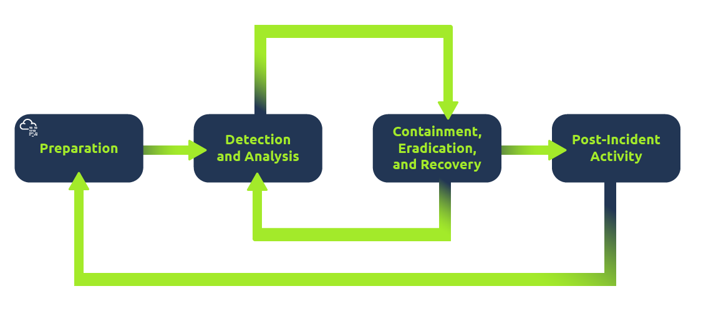
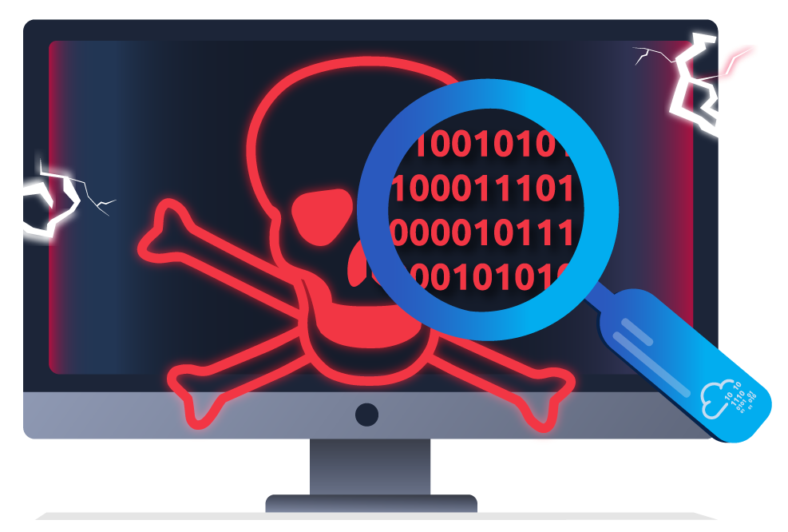

In the previous room, we learned about offensive security, which aims to identify and exploit system vulnerabilities to enhance security measures. This includes exploiting software bugs, leveraging insecure setups, and taking advantage of unenforced access control policies, among other strategies. Red teams and penetration testers specialize in these offensive techniques.

In this room, we will examine its counterpart, defensive security. It is concerned with two main tasks:

Preventing intrusions from occurring
Detecting intrusions when they occur and responding properly
Blue teams are part of the defensive security landscape.

## Some of the tasks that are related to defensive security include:

### User cyber security awareness: 
Training users about cyber security helps protect against attacks targeting their systems.
### Documenting and managing assets: 
We need to know the systems and devices we must manage and protect adequately.
### Updating and patching systems: 
Ensuring that computers, servers, and network devices are correctly updated and patched against any known vulnerability (weakness).
### Setting up preventative security devices: 
Firewall and intrusion prevention systems (IPS) are critical components of preventative security. Firewalls control what network traffic can go inside and what can leave the system or network. IPS blocks any network traffic that matches present rules and attack signatures.
### Setting up logging and monitoring devices: 
Proper network logging and monitoring are essential for detecting malicious activities and intrusions. If a new unauthorized device appears on our network, we should be able to detect it.

# There is much more to defensive security. Aside from the above, we will also cover the following related topics:

## Security Operations Center (SOC)
## Threat Intelligence
## Digital Forensics and Incident Response (DFIR)
## Malware Analysis

## Security Operations Center (SOC)
A Security Operations Center (SOC) is a team of cyber security professionals that monitors the network and its systems to detect malicious cyber security events. Some of the main areas of interest for a SOC are:

### Vulnerabilities: 
Whenever a system vulnerability (weakness) is discovered, it is essential to fix it by installing a proper update or patch. When a fix is unavailable, the necessary measures should be taken to prevent an attacker from exploiting it. Although remediating vulnerabilities is vital to a SOC, it is not necessarily assigned to them.

### Policy violations: 
A security policy is a set of rules required to protect the network and systems. For example, it might be a policy violation if users upload confidential company data to an online storage service.

### Unauthorized activity: 
Consider the case where a user’s login name and password are stolen, and the attacker uses them to log into the network. A SOC must detect and block such an event as soon as possible before further damage is done.

### Network intrusions: 
No matter how good your security is, there is always a chance for an intrusion. An intrusion can occur when a user clicks on a malicious link or when an attacker exploits a public server. Either way, when an intrusion occurs, we must detect it as soon as possible to prevent further damage.
Security operations cover various tasks to ensure protection; one such task is threat intelligence.

## Analysts in a SOC Room

### Threat Intelligence
In this context, intelligence refers to information you gather about actual and potential enemies. A threat is any action that can disrupt or adversely affect a system. Threat intelligence collects information to help the company better prepare against potential adversaries. The purpose would be to achieve a threat-informed defence. Different companies have different adversaries. Some adversaries might seek to steal customer data from a mobile operator; however, other adversaries are interested in halting the production in a petroleum refinery. Example adversaries include a nation-state cyber army working for political reasons and a ransomware group acting for financial purposes. Based on the company (target), we can expect adversaries.

Data being filtered via Threat Intelligence

Intelligence needs data. Data has to be collected, processed, and analyzed. Data is collected from local sources such as network logs and public sources such as forums. Data processing arranges it into a format suitable for analysis. The analysis phase seeks to find more information about the attackers and their motives; moreover, it aims to create a list of recommendations and actionable steps.

Learning about your adversaries lets you know their tactics, techniques, and procedures. As a result of threat intelligence, we identify the threat actor (adversary) and predict their activity. Consequently, we can mitigate their attacks and prepare a response strategy.

## Digital Forensics and Incident Response (DFIR)
This section is about Digital Forensics and Incident Response (DFIR), and we will cover:

### Digital Forensics
### Incident Response
### Malware Analysis

## Digital Forensics
=> Forensics is the application of science to investigate crimes and establish facts. With the use and spread of digital systems, such as computers and smartphones, a new branch of forensics was born to investigate related crimes: computer forensics, which later evolved into digital forensics.

=> In defensive security, the focus of digital forensics shifts to analyzing evidence of an attack and its perpetrators and other areas such as intellectual property theft, cyber espionage, and possession of unauthorized content. Consequently, digital forensics will focus on different areas, such as:

### File System: 
Analyzing a digital forensics image (low-level copy) of a system’s storage reveals much information, such as installed programs, created files, partially overwritten files, and deleted files.
### System memory: 
If the attacker runs their malicious program in memory without saving it to the disk, taking a forensic image (low-level copy) of the system memory is the best way to analyze its contents and learn about the attack.
### System logs: 
Each client and server computer maintains different log files about what is happening. Log files provide plenty of information about what happened on a system. Even if the attacker tries to clear their traces, some traces will remain.
### Network logs: 
Logs of the network packets that have traversed a network would help answer more questions about whether an attack is occurring and what it entails.

## Incident Response
An incident usually refers to a data breach or cyber attack; however, in some cases, it can be something less critical, such as a misconfiguration, an intrusion attempt, or a policy violation. Examples of a cyber attack include an attacker making our network or systems inaccessible, defacing (changing) the public website, and data breach (stealing company data). How would you respond to a cyber attack? Incident response specifies the methodology that should be followed to handle such a case. The aim is to reduce damage and recover in the shortest time possible. Ideally, you would develop a plan that is ready for incident response.

## The four major phases of the incident response process are:

### Preparation: 
This requires a team trained and ready to handle incidents. Ideally, various measures are put in place to prevent incidents from happening in the first place.
### Detection and Analysis: 
The team has the necessary resources to detect any incident; moreover, it is essential to analyze any detected incident further to learn about its severity.
### Containment, Eradication, and Recovery: 
Once an incident is detected, it is crucial to stop it from affecting other systems, eliminate it, and recover the affected systems. For instance, when we notice that a system is infected with a computer virus, we would like to stop (contain) the virus from spreading to other systems, clean (eradicate) the virus, and ensure proper system recovery.
### Post-Incident Activity: 
After a successful recovery, a report is produced, and the lesson learned is shared to prevent similar future incidents.

# Incidence Response Flowchart

## Malware Analysis
Malware stands for malicious software. Software refers to programs, documents, and files you can save on a disk or send over the network. Malware includes many types, such as:

=> A virus is a piece of code (part of a program) that attaches itself to a program. It is designed to spread from one computer to another and works by altering, overwriting, and deleting files once it infects a computer. The result ranges from the computer becoming slow to unusable.
=> Trojan Horse is a program that shows one desirable function but hides a malicious function underneath. For example, a victim might download a video player from a shady website that gives the attacker complete control over their system.
=> Ransomware is a malicious program that encrypts the user’s files. Encryption makes the files unreadable without knowing the encryption password. The attacker offers the user the encryption password if the user is willing to pay a “ransom.”

## Malware analysis aims to learn about such malicious programs using various means:

### Static analysis works by inspecting the malicious program without running it. This usually requires solid knowledge of assembly language (the processor’s instruction set, i.e., the computer’s fundamental instructions).
### Dynamic analysis works by running the malware in a controlled environment and monitoring its activities. It lets you observe how the malware behaves when running.

-------------------------------------------------------------------------------------------------------------------------------------------------------------------

# The Scenario

Let us pretend you are a Security Operations Center (SOC) analyst responsible for protecting a bank. This bank's SOC uses a Security Information and Event Management (SIEM) tool, which gathers security-related information and events from various sources and presents them in one dashboard. If the SIEM finds something suspicious, an alert will be generated.

A monitor showing multiple alerts

Not all alerts are malicious, however. It is up to the analyst to use their expertise in cyber security to investigate which ones are harmful.

For example, you may encounter an alert where a user has failed multiple login attempts. While suspicious, this kind of thing happens, especially if the user has forgotten their password and continues to try to log in. 

Additionally, there might be alerts related to connections from unknown IP addresses. An IP address is like a home address for your computer on the Internet—it tells other computers where to send the information you request. When these addresses are unknown, it could mean that someone new is trying to connect or someone is attempting unauthorized access.

