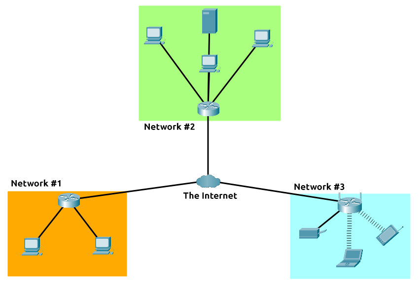

"To outsmart a hacker, you need to think like one."

This is the core of "Offensive Security." It involves breaking into computer systems, exploiting software bugs, and finding loopholes in applications to gain unauthorized access. The goal is to understand hacker tactics and enhance our system defences.

