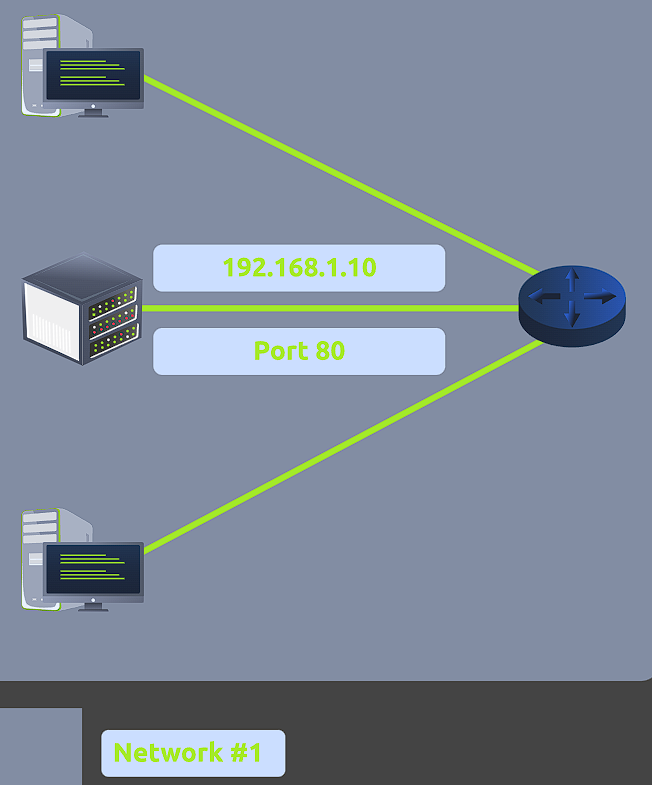
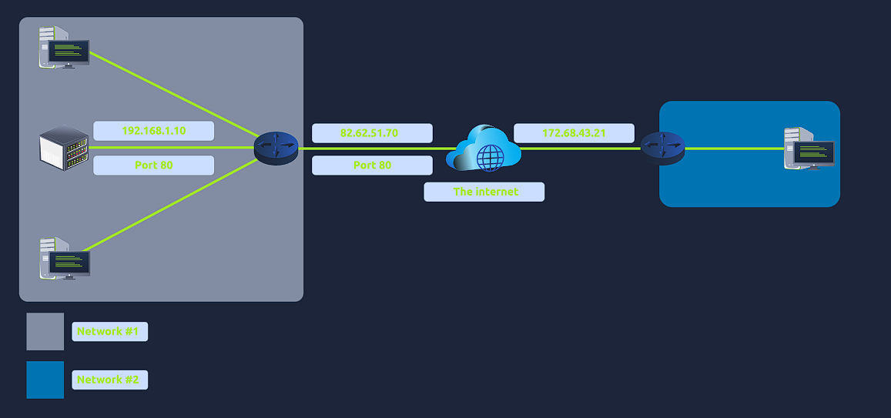
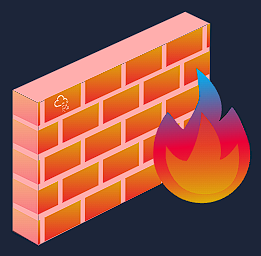
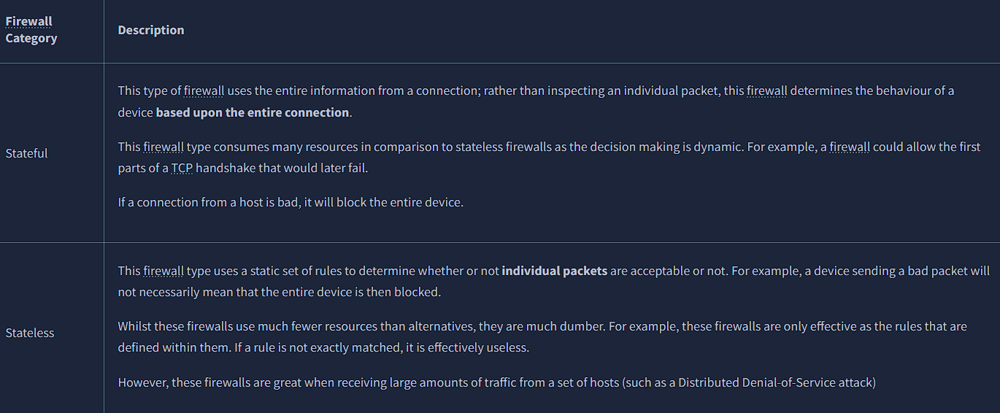
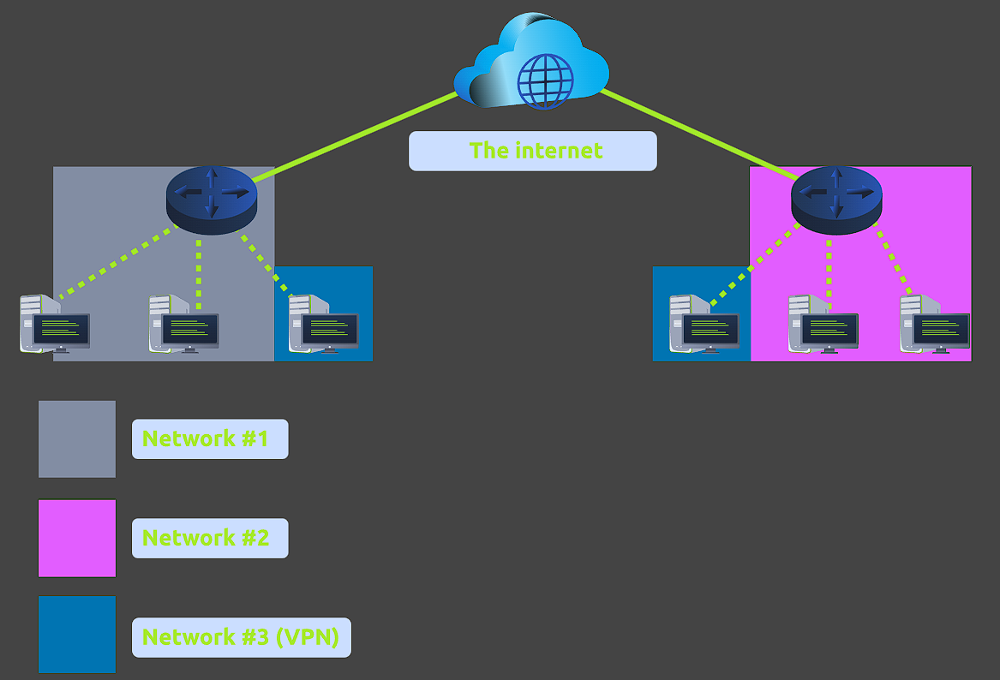
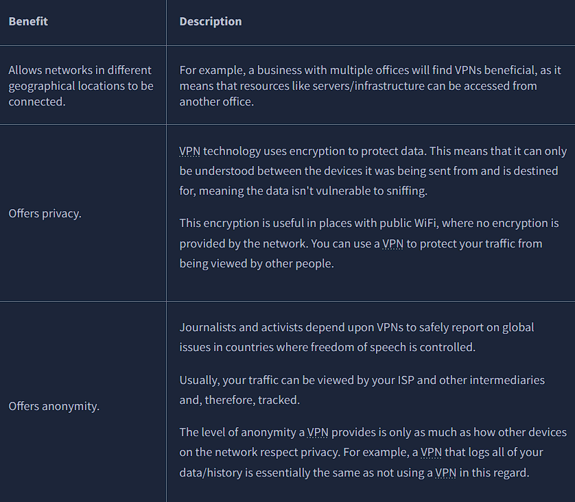
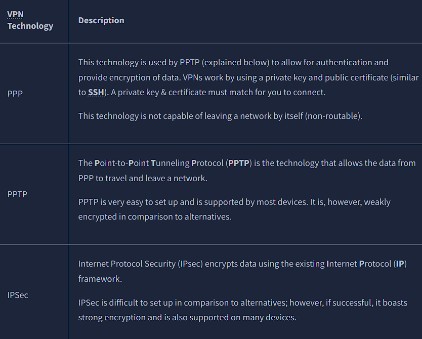
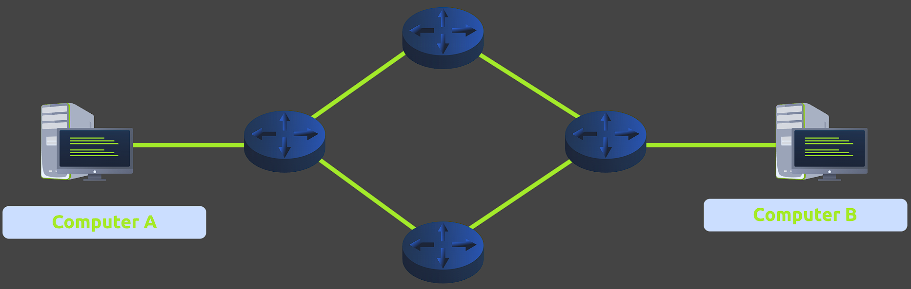
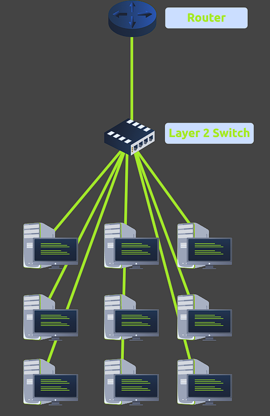
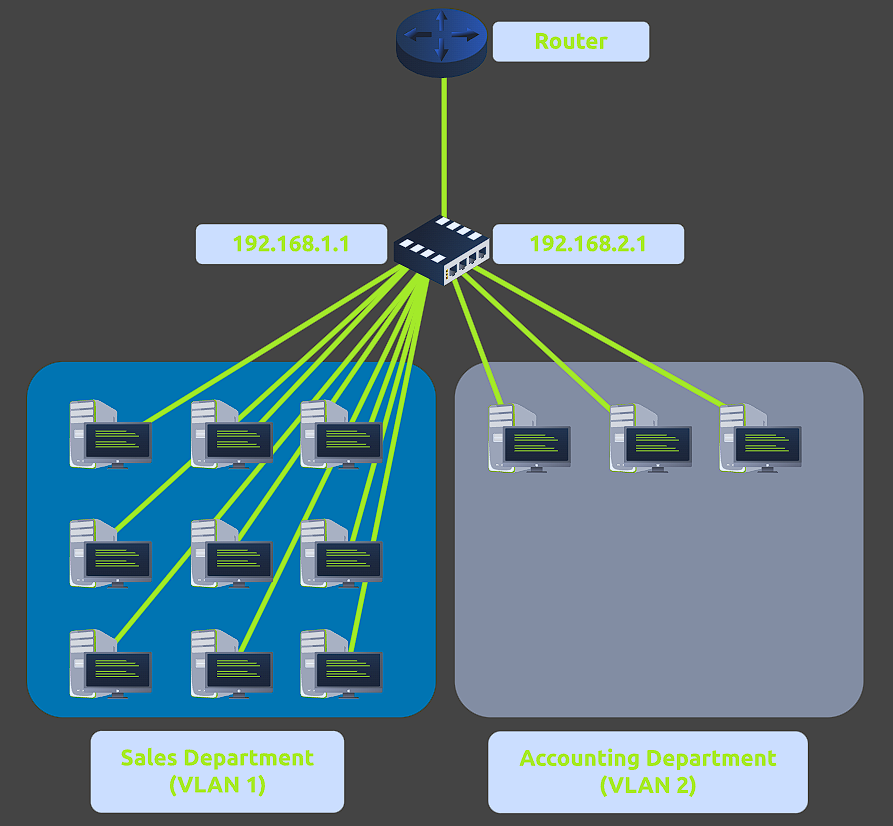

# Task 1 : Introduction to Port Forwarding

Port forwarding is an essential component in connecting applications and services to the Internet. Without port forwarding, applications and services such as web servers are only available to devices within the same direct network.

Take the network below as an example. Within this network, the server with an IP address of "192.168.1.10" runs a webserver on port 80. Only the two other computers on this network will be able to access it (this is known as an intranet).

If the administrator wanted the website to be accessible to the public (using the Internet), they would have to implement port forwarding, like in the diagram below:

With this design, Network #2 will now be able to access the webserver running on Network #1 using the public IP address of Network #1 (82.62.51.70).

It is easy to confuse port forwarding with the behaviours of a firewall (a technology we'll come on to discuss in a later task). However, at this stage, just understand that port forwarding opens specific ports (recall how packets work). In comparison, firewalls determine if traffic can travel across these ports (even if these ports are open by port forwarding).

Port forwarding is configured at the router of a network.

# Task 2 : Firewalls 101

A firewall is a device within a network responsible for determining what traffic is allowed to enter and exit. Think of a firewall as border security for a network. An administrator can configure a firewall to permit or deny traffic from entering or exiting a network based on numerous factors such as:

- Where the traffic is coming from? (has the firewall been told to accept/deny traffic from a specific network?)
- Where is the traffic going to? (has the firewall been told to accept/deny traffic destined for a specific network?)
- What port is the traffic for? (has the firewall been told to accept/deny traffic destined for port 80 only?)
- What protocol is the traffic using? (has the firewall been told to accept/deny traffic that is UDP, TCP or both?)
- Firewalls perform packet inspection to determine the answers to these questions.

Firewalls come in all shapes and sizes. From dedicated pieces of hardware (often found in large networks like businesses) that can handle a magnitude of data to residential routers (like at your home!) or software such as Snort, firewalls can be categorised into 2 to 5 categories.

We'll cover the two primary categories of firewalls in the table below:

# Task 4 : VPN Basics

A Virtual Private Network (or VPN for short) is a technology that allows devices on separate networks to communicate securely by creating a dedicated path between each other over the Internet (known as a tunnel). Devices connected within this tunnel form their own private network.

For example, only devices within the same network (such as within a business) can directly communicate. However, a VPN allows two offices to be connected. Let's take the diagram below, where there are three networks:

# Task 5 : LAN Networking Devices

### What is a Router?

It's a router's job to connect networks and pass data between them. It does this by using routing (hence the name router!).

Routing is the label given to the process of data travelling across networks. Routing involves creating a path between networks so that this data can be successfully delivered. Routers operate at Layer 3 of the OSI model. They often feature an interactive interface (such as a website or a console) that allows an administrator to configure various rules such as port forwarding or firewalling.

Routing is useful when devices are connected by many paths, such as in the example diagram below, where the most optimal path is taken:

Routers are dedicated devices and do not perform the same functions as switches.

We can see that Computer A's network is connected to the network of Computer B by two routers in the middle. The question is: what path will be taken? Different protocols will decide what path should be taken, but factors include:

- What path is the shortest?

- What path is the most reliable?

- Which path has the faster medium (e.g. copper or fibre)?

### WHAT IS A SWITCH?

A switch is a dedicated networking device responsible for providing a means of connecting to multiple devices. Switches can facilitate many devices (from 3 to 63) using Ethernet cables.

Switches can operate at both layer 2 and layer 3 of the OSI model. However, these are exclusive in the sense that Layer 2 switches cannot operate at layer 3.

Take, for example, a layer 2 switch in the diagram below. These switches will forward frames (remember these are no longer packets as the IP protocol has been stripped) onto the connected devices using their MAC address.

Now, let's move onto layer 3 switches. These switches are more sophisticated than layer 2, as they can perform some of the responsibilities of a router. Namely, these switches will send frames to devices (as layer 2 does) and route packets to other devices using the IP protocol. 

Let's take a look at the diagram below of a layer 3 switch in action. We can see that there are two IP addresses: 

192.168.1.1
192.168.2.1

A technology called VLAN (Virtual Local Area Network) allows specific devices within a network to be virtually split up. This split means they can all benefit from things such as an Internet connection but are treated separately. This network separation provides security because it means that rules in place determine how specific devices communicate with each other. This segregation is illustrated in the diagram below:

