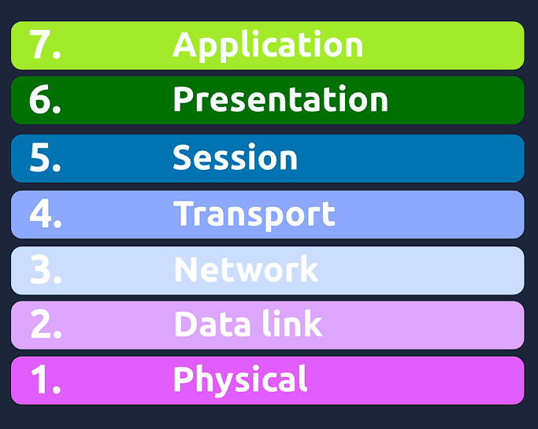
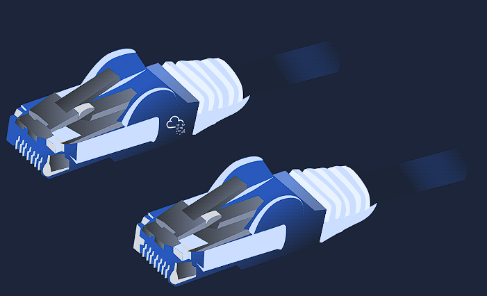
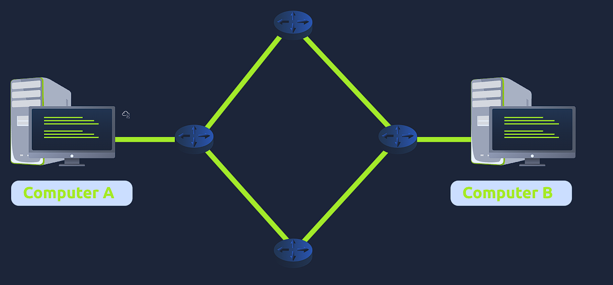
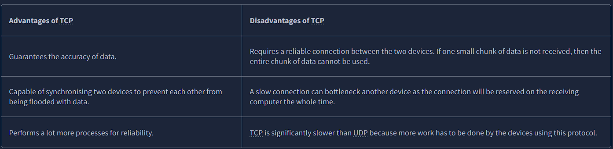
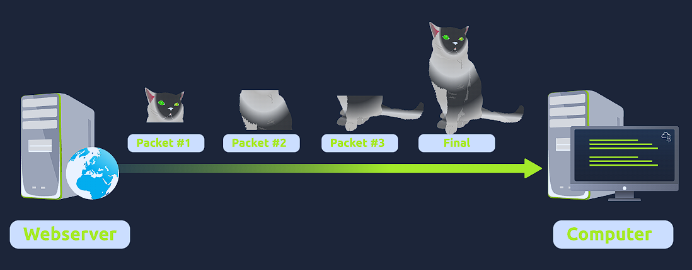
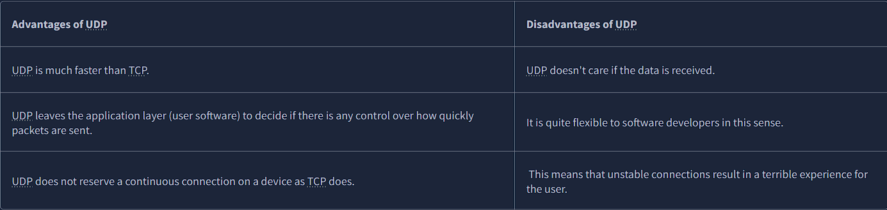

# Task 1 : What is the OSI Model?

The OSI model (or Open Systems Interconnection Model) is an essential model used in networking.  This critical model provides a framework dictating how all networked devices will send, receive and interpret data.

One of the main benefits of the OSI model is that devices can have different functions and designs on a network while communicating with other devices. Data sent across a network that follows the uniformity of the OSI model can be understood by other devices.

The OSI model consists of seven layers which are illustrated in the diagram below. Each layer has a different set of responsibilities and is arranged from Layer 7 to Layer 1.

At every individual layer that data travels through, specific processes take place, and pieces of information are added to this data, which is what we'll come to discuss in the upcoming tasks within this room. However, for now, we only need to understand that this process is called encapsulation and what the OSI model looks like in the diagram below:

# Task 2 : Layer 1 - Physical

This layer is one of the easiest layers to grasp. Put simply, this layer references the physical components of the hardware used in networking and is the lowest layer that you will find. Devices use electrical signals to transfer data between each other in a binary numbering system (1's and 0's).

For example, ethernet cables connecting devices, such as in the picture below:

# Task 3 : Layer 2 - Data Link

The data link layer focuses on the physical addressing of the transmission. It receives a packet from the network layer (including the IP address for the remote computer) and adds in the physical MAC (Media Access Control) address of the receiving endpoint. Inside every network-enabled computer is a Network Interface Card (NIC) which comes with a unique MAC address to identify it.

MAC addresses are set by the manufacturer and literally burnt into the card; they can’t be changed – although they can be spoofed. When information is sent across a network, it’s actually the physical address that is used to identify where exactly to send the information.

Additionally, it’s also the job of the data link layer to present the data in a format suitable for transmission.

# Task 4 : Layer 3 - Network

The third layer of the OSI model (network layer) is where the magic of routing & re-assembly of data takes place (from these small chunks to the larger chunk). Firstly, routing simply determines the most optimal path in which these chunks of data should be sent.

Whilst some protocols at this layer determine exactly what is the "optimal" path that data should take to reach a device, we should only know about their existence at this stage of the networking module. Briefly, these protocols include OSPF (Open Shortest Path First) and RIP (Routing Information Protocol). The factors that decide what route is taken is decided by the following:

What path is the shortest? I.e. has the least amount of devices that the packet needs to travel across.
What path is the most reliable? I.e. have packets been lost on that path before?
Which path has the faster physical connection? I.e. is one path using a copper connection (slower) or a fibre (considerably faster)?
At this layer, everything is dealt with via IP addresses such as 192.168.1.100. Devices such as routers capable of delivering packets using IP addresses are known as Layer 3 devices — because they are capable of working at the third layer of the OSI model.

# Task 5 : Layer 4 - Transport

Layer 4 of the OSI model plays a vital part in transmitting data across a network and can be a little bit difficult to grasp. When data is sent between devices, it follows one of two different protocols that are decided based upon several factors:

.- TCP
:- UDP

Let's begin with TCP. The Transmission Control Protocol (TCP). Potentially hinted by the name, this protocol is designed with reliability and guarantee in mind. This protocol reserves a constant connection between the two devices for the amount of time it takes for the data to be sent and received.

Not only this, but TCP incorporates error checking into its design. Error checking is how TCP can guarantee that data sent from the small chunks in the session layer (layer 5) has then been received and reassembled in the same order.

Let's summarise the advantages and disadvantages of TCP in the table below:

TCP is used for situations such as file sharing, internet browsing or sending an email. This usage is because these services require the data to be accurate and complete (no good having half a file!).

In the diagram below, we can see how a picture of a cat is broken down into small pieces of data (known as packets) from the "webserver", where the "computer" re-constructs the picture of the cat into the correct order.

Now let's move onto the User Datagram Protocol (or UDP for short). This protocol is not nearly as advanced as its brother - the TCP protocol. It doesn't boast the many features offered by TCP, such as error checking and reliability. In fact, any data that gets sent via UDP is sent to the computer whether it gets there or not. There is no synchronisation between the two devices or guarantee; just hope for the best, and fingers crossed.

Whilst this sounds disadvantageous, it does have its merits, which we'll layout in the table below:

UDP is useful in situations where there are small pieces of data being sent. For example, protocols used for discovering devices (ARP and DHCP that we discussed in Room 2 - Intro to LAN) or larger files such as video streaming (where it is okay if some part of the video is pixelated. Pixels are just lost pieces of data!)

# Task 6 : Layer 5 - Session

Once data has been correctly translated or formatted from the presentation layer (layer 6), the session layer (layer 5) will begin to create and maintain the connection to other computer for which the data is destined. When a connection is established, a session is created. Whilst this connection is active, so is the session.

The session layer is also responsible for closing the connection if it hasn't been used in a while or if it is lost. Additionally, a session can contain "checkpoints," where if the data is lost, only the newest pieces of data are required to be sent, saving bandwidth. 

What is worthy of noting is that sessions are unique — meaning that data cannot travel over different sessions, but in fact, only across each session instead.

# Task 7 : Layer 6 - Presentation

Layer 6 of the OSI model is the layer in which standardisation starts to take place. Because software developers can develop any software such as an email client differently, the data still needs to be handled in the same way — no matter how the software works.

This layer acts as a translator for data to and from the application layer (layer 7). The receiving computer will also understand data sent to a computer in one format destined for in another format. For example, when you send an email, the other user may have another email client to you, but the contents of the email will still need to display the same.

Security features such as data encryption (like HTTPS when visiting a secure site) occur at this layer.

# Task 8 : Layer 7 - Application

The application layer of the OSI model is the layer that you will be most familiar with. This familiarity is because the application layer is the layer in which protocols and rules are in place to determine how the user should interact with data sent or received.

Everyday applications such as email clients, browsers, or file server browsing software such as FileZilla provide a friendly, Graphical User Interface (GUI) for users to interact with data sent or received. Other protocols include DNS (Domain Name System), which is how website addresses are translated into IP addresses.

