# Task 1 : What are Packets and Frames

Packets and frames are small pieces of data that, when forming together, make a larger piece of information or message. However, they are two different things in the OSI model. A frame is at layer 2 - the data link layer, meaning there is no such information as IP addresses. Think of this as putting an envelope within an envelope and sending it away. The first envelope will be the packet that you mail, but once it is opened, the envelope within still exists and contains data (this is a frame).

This process is called encapsulation which we discussed in room 3: the OSI model. At this stage, it's safe to assume that when we are talking about anything IP addresses, we are talking about packets. When the encapsulating information is stripped away, we're talking about the frame itself.

Packets are an efficient way of communicating data across networked devices such as those explained in Task 1. Because this data is exchanged in small pieces, there is less chance of bottlenecking occurring across a network than large messages being sent at once.

For example, when loading an image from a website, this image is not sent to your computer as a whole, but rather small pieces where it is reconstructed on your computer. Take the image below as an illustration of this process. The cat's picture is divided into three packets, where it is reconstructed when it reaches the computer to form the final image.

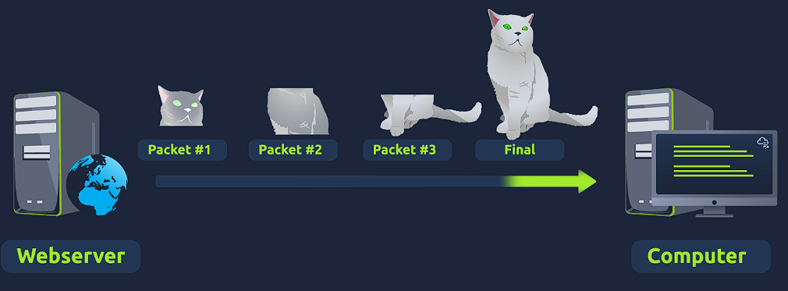

Packets have different structures that are dependant upon the type of packet that is being sent. As we'll come on to discuss, networking is full of standards and protocols that act as a set of rules for how the packet is handled on a device. With billions of devices connected on the internet, things can quickly break down if there is no standardisation.

Let's continue with our example of the Internet Protocol. A packet using this protocol will have a set of headers that contain additional pieces of information to the data that is being sent across a network.

Some notable headers include:

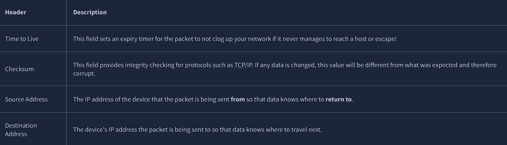

# Task 2 : TCP/IP (The Three-Way Handshake)

### TCP (or Transmission Control Protocol for short) is another one of these rules used in networking.

This protocol is very similar to the OSI model that we have previously discussed in room three of this module so far. The TCP/IP protocol consists of four layers and is arguably just a summarised version of the OSI model. These layers are:

:- Application
:- Transport
:- Internet
:- Network Interface

Very similar to how the OSI model works, information is added to each layer of the TCP model as the piece of data (or packet) traverses it. As you may recall, this process is known as encapsulation - where the reverse of this process is decapsulation.

One defining feature of TCP is that it is connection-based, which means that TCP must establish a connection between both a client and a device acting as a server before data is sent.

Because of this, TCP guarantees that any data sent will be received on the other end. This process is named the Three-way handshake, which is something we'll come on to discuss shortly. A table comparing the advantages and disadvantages of TCP is located below:

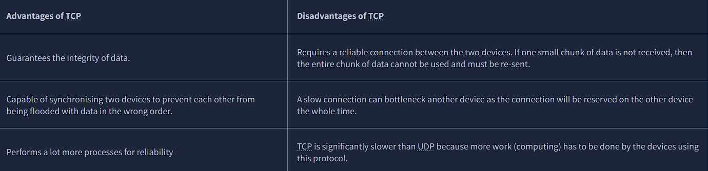

### TCP packets contain various sections of information known as headers that are added from encapsulation. Let's explain some of the crucial headers in the table below:

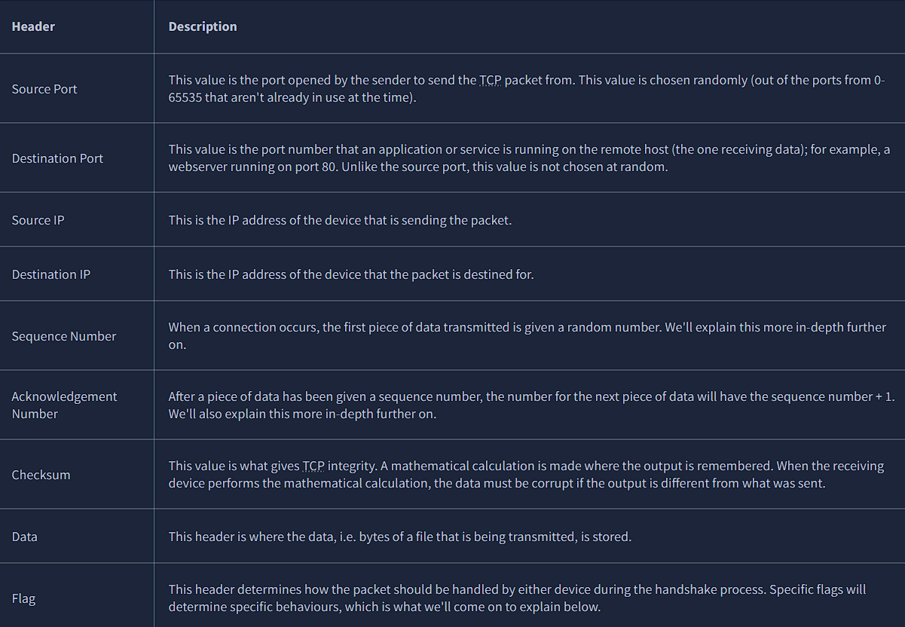

### Next, we'll come on to discuss the Three-way handshake - the term given for the process used to establish a connection between two devices. The Three-way handshake communicates using a few special messages - the table below highlights the main ones:

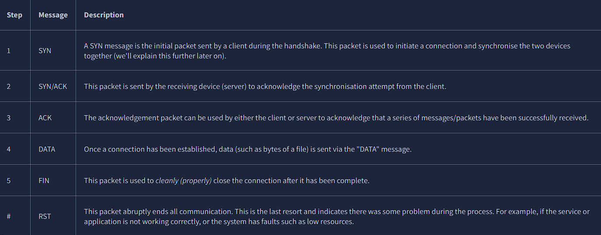

Any sent data is given a random number sequence and is reconstructed using this number sequence and incrementing by 1. Both computers must agree on the same number sequence for data to be sent in the correct order. This order is agreed upon during three steps:

SYN - Client: Here's my Initial Sequence Number(ISN) to SYNchronise with (0)
SYN/ACK - Server: Here's my Initial Sequence Number (ISN) to SYNchronise with (5,000), and I ACKnowledge your initial number sequence (0)
ACK - Client: I ACKnowledge your Initial Sequence Number (ISN) of (5,000), here is some data that is my ISN+1 (0 + 1)

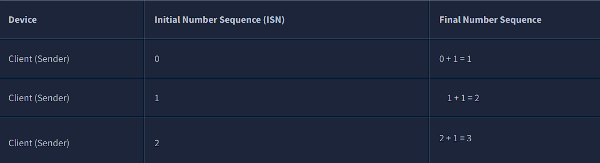

### TCP Closing a Connection:

Let's quickly explain the process behind TCP closing a connection. First, TCP will close a connection once a device has determined that the other device has successfully received all of the data.

Because TCP reserves system resources on a device, it is best practice to close TCP connections as soon as possible.

To initiate the closure of a TCP connection, the device will send a "FIN" packet to the other device. Of course, with TCP, the other device will also have to acknowledge this packet.

Let's show this process using Alice and Bob as we have previously.

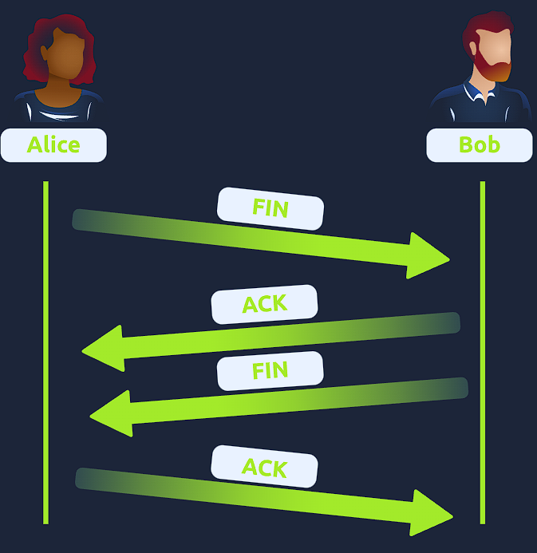

# Task 4 : UDP/IP

The User Datagram Protocol (UDP) is another protocol that is used to communicate data between devices.

Unlike its brother TCP, UDP is a stateless protocol that doesn't require a constant connection between the two devices for data to be sent. For example, the Three-way handshake does not occur, nor is there any synchronisation between the two devices.

Recall some of the comparisons made about these two protocols in Room 3: "OSI Model". Namely, UDP is used in situations where applications can tolerate data being lost (such as video streaming or voice chat) or in scenarios where an unstable connection is not the end-all. A table comparing the advantages and disadvantages of UDP is located below:

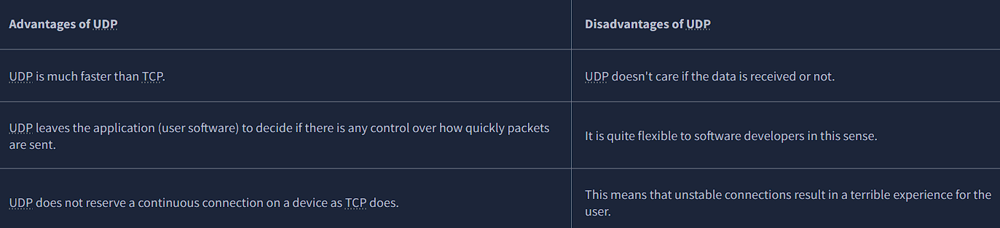

As mentioned, no process takes place in setting up a connection between two devices. Meaning that there is no regard for whether or not data is received, and there are no safeguards such as those offered by TCP, such as data integrity.

UDP packets are much simpler than TCP packets and have fewer headers. However, both protocols share some standard headers, which are what is annotated in the table below:

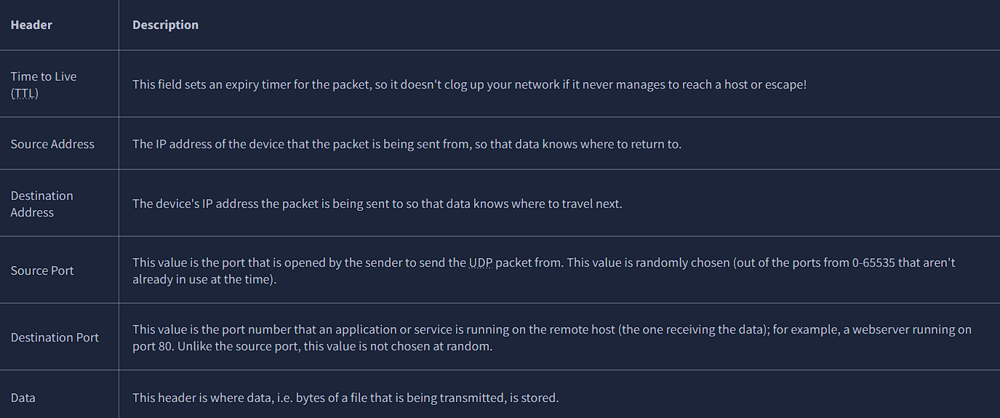

Next, we'll come on to discuss how the process of a connection via UDP differs from that of something such as TCP.  We should recall that UDP is stateless. No acknowledgement is sent during a connection.

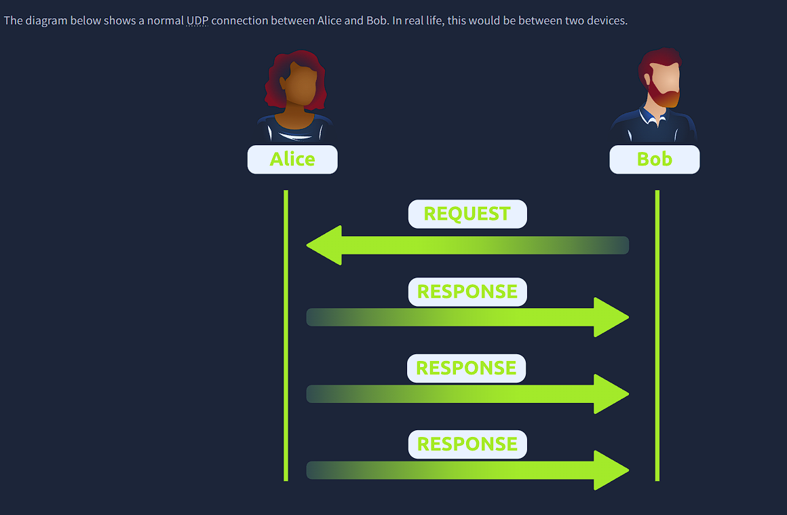

# Task 5 : Ports 101

Perhaps aptly titled by their name, ports are an essential point in which data can be exchanged. Think of a harbour and port. Ships wishing to dock at the harbour will have to go to a port compatible with the dimensions and the facilities located on the ship. When the ship lines up, it will connect to a port at the harbour. Take, for instance, that a cruise liner cannot dock at a port made for a fishing vessel and vice versa.

These ports enforce what can park and where — if it isn't compatible, it cannot park here. Networking devices also use ports to enforce strict rules when communicating with one another. When a connection has been established (recalling from the OSI model's room), any data sent or received by a device will be sent through these ports. In computing, ports are a numerical value between 0 and 65535 (65,535).

Because ports can range from anywhere between 0-65535, there quickly runs the risk of losing track of what application is using what port. A busy harbour is chaos! Thankfully, we associate applications, software and behaviours with a standard set of rules. For example, by enforcing that any web browser data is sent over port 80, software developers can design a web browser such as Google Chrome or Firefox to interpret the data the same way as one another.

This means that all web browsers now share one common rule: data is sent over port 80. How the browsers look, feel and easy to use is up to the designer or the user's decision.

While the standard rule for web data is port 80, a few other protocols have been allocated a standard rule. Any port that is within 0 and 1024 (1,024) is known as a common port. Let's explore some of these other protocols below:

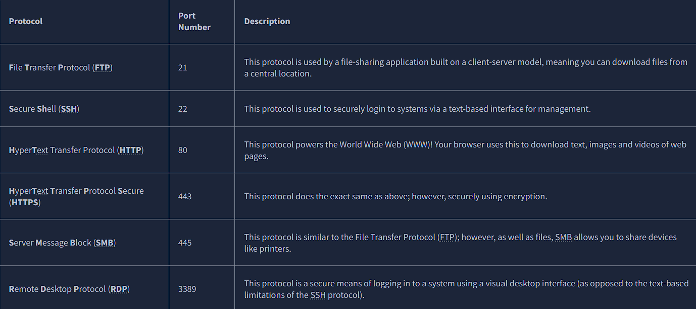

